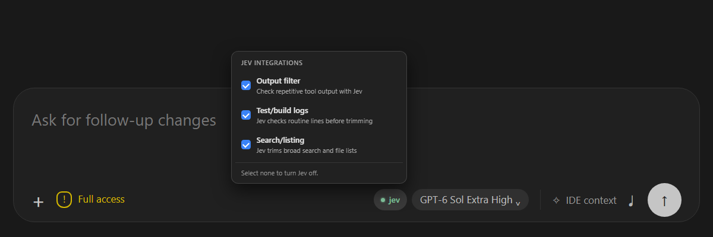
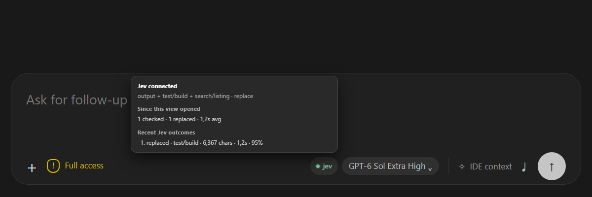

# Codex Jev


Codex Jev trims large tool results before Codex reads them. It uses Jev to decide which repetitive lines can be omitted, keeps the exact original for recovery, and leaves uncertain results intact.

## Integrations

| Selectable integration | What Codex gets |
| --- | --- |
| Output filter | A shorter excerpt of repetitive tool output. |
| Test/build logs | Failures and completion summaries without routine pass and progress lines. |
| Search/listing | Relevant matches and representative file paths from broad results. |

All integrations start off. The companion VS Code control lets you select each one and shows connection health and recent outcomes.
The screenshots below use synthetic selections and activity.



## Measured results

A [live hook benchmark](docs/_benchmarks/2026-09-26.md) ran the three integrations over real command output with 30 Jev calls. Token counts use `o200k_base`.

| Integration | Replaced results | Model-visible tokens saved | Reduction on replaced results |
| --- | ---: | ---: | ---: |
| Output filter | 9 | 48,886 | 95.3% |
| Test/build logs | 12 | 13,475 | **90.0%** |
| Search/listing | 3 | 8,346 | 71.3% |

Across all 36 results, including oversized inputs that the hook deliberately skipped, the integrations saved **70,707 model-visible tokens**. These are tool-output measurements, not billed-token or full-task savings. Jev kept all six search-hit outputs when it was uncertain.



## Get started

```bash
codex plugin marketplace add https://github.com/PhilippElhaus/Codex-Jev
codex plugin add codex-jev@codex-jev
```

[Save the Jev API key in the installed plugin's private `.env`](docs/_setup/install.md#jev-api-key), then start a new Codex thread and select an integration. For the composer control, follow the [VS Code setup](vscode-control/README.md).

## Documentation

- [Installation, credentials, and migration](docs/_setup/install.md)
- [Integration behavior and data handling](docs/_reference/behavior-and-data.md)
- [VS Code control details](docs/_reference/vscode-ui.md)
- [Benchmarks and measurement notes](docs/_benchmarks/2026-09-26.md)
- [Verification](docs/_development/verification.md)
