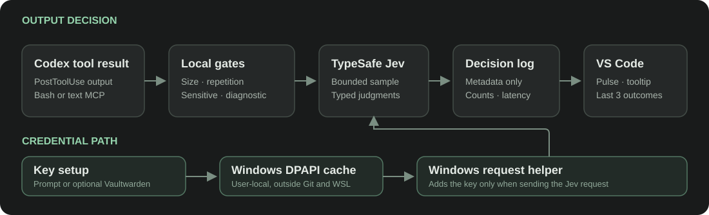

# Jev Output Pilot

An installed, opt-in Codex plugin with one synchronous `PostToolUse` hook. Its
default config is `enabled: false`, `mode: "observe"`. The hook considers only
large, repetitive Bash output and text-only MCP output. Observe mode records a
metadata-only decision without changing the result Codex sees. Replacement
requires a separate `mode: "replace"` config change; it saves the exact Bash
output privately before returning an excerpt and recovery path. MCP replacement
has its own additional opt-in.

The hook skips small, oversized, sensitive-looking, diagnostic, structured, and
non-repetitive results locally. A qualifying result sends at most a bounded
sample to Jev for three `Noul` judgments. API errors, uncertain scores, and
storage failures retain the original result. The sensitive-content filter is
conservative and cannot prove arbitrary output is safe to send to an external
API; select the hook only for workspaces where this data boundary is acceptable.

## Interface preview

These synthetic screenshots use the real composer control script. They contain
no workspace output or credentials.


The [blue call state](docs/images/jev-pulse.png) fades in and out as shown in
the [pulse timeline](docs/images/jev-pulse-timeline.svg).



## Credentials

Set up a TypeSafe API key on Windows with PowerShell 7. For a portable setup,
enter it at the protected prompt:

```powershell
pwsh -File .\plugins\codex-jev-output-pilot\scripts\install_key_cache.ps1 -PromptForKey
```

For automatic refresh from an existing Vaultwarden helper, configure that
helper locally. The helper must support `materialize -CollectionName ... -Name
... -OutputPath ...`. This path and item metadata are stored only under the
Windows user's local application data:

```powershell
pwsh -File .\plugins\codex-jev-output-pilot\scripts\install_key_cache.ps1 `
  -VaultwardenHelper 'C:\path\to\vaultwarden-local.ps1' `
  -CollectionName '<collection>' -ItemName '<item>'
```

Both methods encrypt the key with CurrentUser DPAPI at
`%LOCALAPPDATA%\Codex\jev-output-pilot\key.dpapi` and install the request
helper beside it. The optional Vaultwarden source metadata stays in
`credential-source.json` in the same protected directory; it contains no key.
The WSL hook sends a bounded request to the Windows helper over stdin. The key
does not enter WSL environment variables, command arguments, plugin data, or
Jev logs. The control checks API health at startup and every five minutes.
With a configured Vaultwarden source it refreshes a missing or rejected key;
prompt-based setup requires repeating the prompt if the key changes.

## UI and configuration

The companion VS Code extension in [`vscode-control/`](vscode-control/) adds a
status-bar control and a private message bridge for a `jev` text button in the
Codex composer. Clicking the composer button opens a one-hook checkbox list;
clearing it disables Jev. The button is gray when off, green after a successful
API/key check, red on failure, and blue for about 500 ms while Jev is called.
It docks before the model selector, reduces to a dot as that gap narrows, and
hides before it would overlap the selector. Hovering shows the three most
recent metadata-only Jev outcomes and call totals since the control opened.
Routine small tool results do not erase that history. The hook selection is
stored in the Codex plugin's `PLUGIN_DATA/config.json` directory, outside this
repository. A personal marketplace installation can use
`~/.codex/plugins/data/codex-jev-output-pilot-personal/config.json` in WSL.
Set `jevPilot.dataDirectory` in VS Code to that installed plugin data directory
(using its `\\wsl.localhost\<distro>\...` path on Windows), or set the
`CODEX_JEV_DATA_DIRECTORY` environment variable. The public extension package
does not contain a workstation-specific default path.

Codex has no supported third-party composer control slot. The composer button
is a **version-pinned local patch** for OpenAI Codex VS Code extension
`26.917.62051`. [`vscode-control/patch_codex_webview.py`](vscode-control/patch_codex_webview.py)
checks exact original hashes, backs up the host files under
`%LOCALAPPDATA%\Codex\jev-output-pilot\rollback\26.917.62051`, installs the
bridge and control, and can restore only when the patched files still match its
recorded hashes. A Codex extension update may remove or invalidate the patch;
re-run validation against that version before repatching. Reload each VS Code
window where the button should appear. The status-bar control remains a fallback.

The hook timeout is five seconds; the Jev request has a three-second API
deadline. Hosted tools such as web search do not pass through this hook.

## Verification

```bash
python3 -m unittest discover -s plugins/codex-jev-output-pilot/tests -v
python3 plugins/codex-jev-output-pilot/scripts/replay.py --per-category 100
npm --prefix plugins/codex-jev-output-pilot/vscode-control test
python3 plugins/codex-jev-output-pilot/vscode-control/scripts/browser_smoke.py
python3 plugins/codex-jev-output-pilot/scripts/live_bridge_smoke.py
pwsh -File plugins/codex-jev-output-pilot/scripts/test_key_cache.ps1
```

The replay covers 1,000 deterministic cases. A prior 90-case live Jev replay
made 30 calls and selected 10 repetitive Bash outputs with no false or missed
replacements against synthetic labels. These labels do not establish accuracy
or net speed on real tasks. Measure representative tasks in off, observe, and
replace modes before judging the actual benefit.
