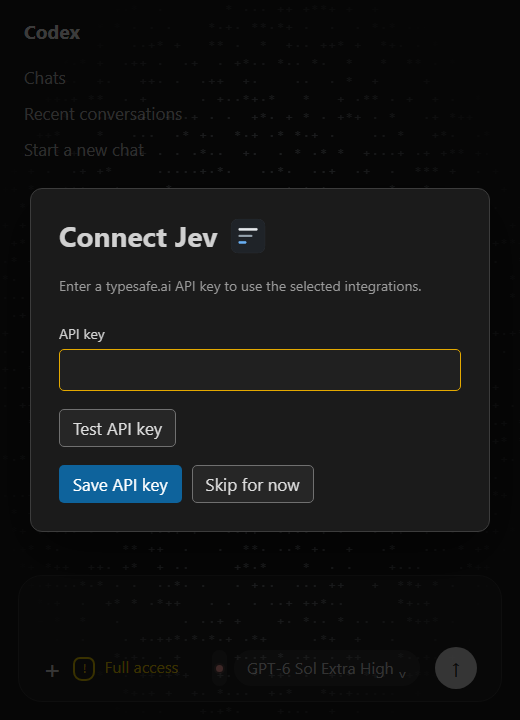
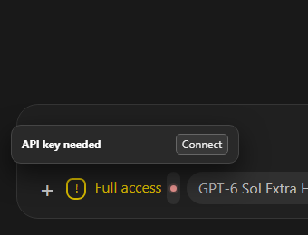
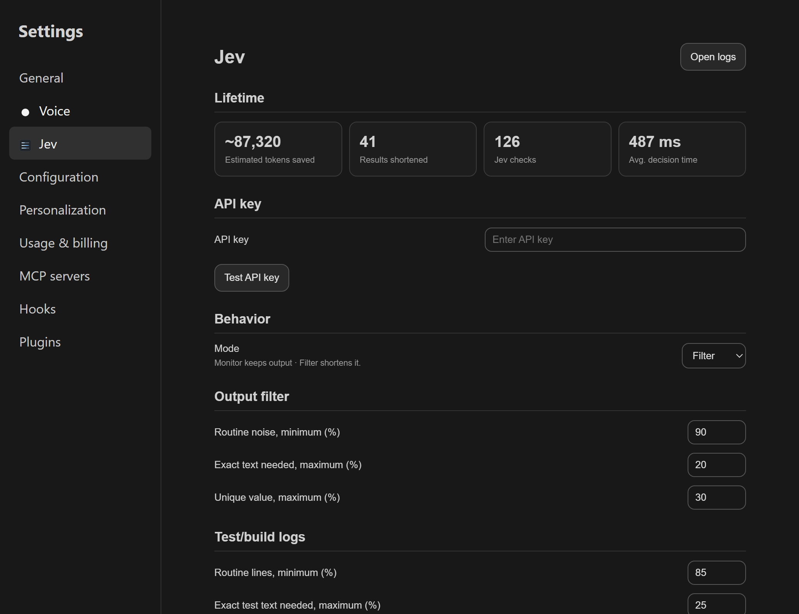

# Codex Jev


Codex Jev trims large tool results before Codex reads them. It uses Jev to decide which repetitive lines can be omitted, keeps the exact original for recovery, and leaves uncertain results intact.

## Integrations

| Selectable integration | What Codex gets |
| --- | --- |
| Output filter | A shorter excerpt of repetitive tool output. |
| Test/build logs | Failures and completion summaries without routine pass and progress lines. |
| Search/listing | Relevant matches and representative file paths from broad results. |

All integrations start off. The button in the Codex composer selects them and shows Jev health and recent outcomes. The composer images show synthetic activity from the current control.


## Settings

Selecting a Jev integration without a key opens **Connect Jev** over the Codex side window. The prompt asks for a typesafe.ai API key. You can test and save it there, or choose **Skip for now** and reopen setup from the Jev menu or the compact missing-key tooltip. In **Codex settings → Jev settings**, the saved key appears as `********`; enter a different key to replace it, or test the saved key without changing it. A bordered Test button shows `OK` or a short failure reason beside it. The page also controls `observe`, `replace`, and the cutoffs for each integration. Changes apply to the next tool result. The captures use example state and contain no key.







## Measured results

A [live hook benchmark](docs/benchmarks/benchmark_live_2026-09-26.md) ran the three integrations over real command output with 30 Jev calls. Token counts use `o200k_base`.

| Integration | Replaced results | Model-visible tokens saved | Reduction on replaced results |
| --- | ---: | ---: | ---: |
| Output filter | 9 | 48,886 | 95.3% |
| Test/build logs | 12 | 13,475 | **90.0%** |
| Search/listing | 3 | 8,346 | 71.3% |

Across all 36 results, including oversized inputs that the hook deliberately skipped, the integrations saved **70,707 model-visible tokens**. These are tool-output measurements, not billed-token or full-task savings. Jev kept all six search-hit outputs when it was uncertain.


## Quick install

```bash
codex plugin marketplace add https://github.com/PhilippElhaus/Codex-Jev
codex plugin add codex-jev@codex-jev
```

Build the [VS Code control VSIX](vscode-control/README.md) and install `codex-jev-control-0.2.11.vsix`. Set `codexJev.dataDirectory` to the plugin data directory, and apply the version-pinned composer patch. Enable an integration to open key setup when no key is saved. Start a new Codex thread.

## Documentation

- [Installation](docs/setup/setup_installation.md), [credentials](docs/setup/setup_credentials.md), and [migration](docs/setup/setup_migration.md)
- [Integration design](docs/architecture/design_integrations.md) and [data handling](docs/architecture/design_data.md)
- [VS Code control](docs/architecture/design_vscode.md)
- [Benchmarks](docs/benchmarks/benchmark_live_2026-09-26.md) and [verification](docs/development/development_verification.md)
