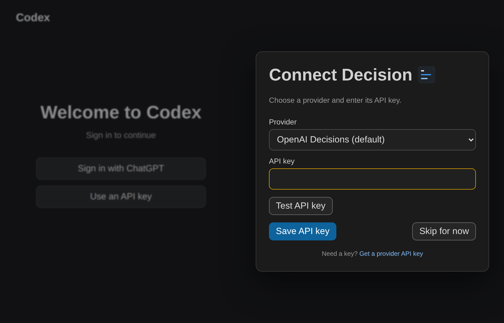
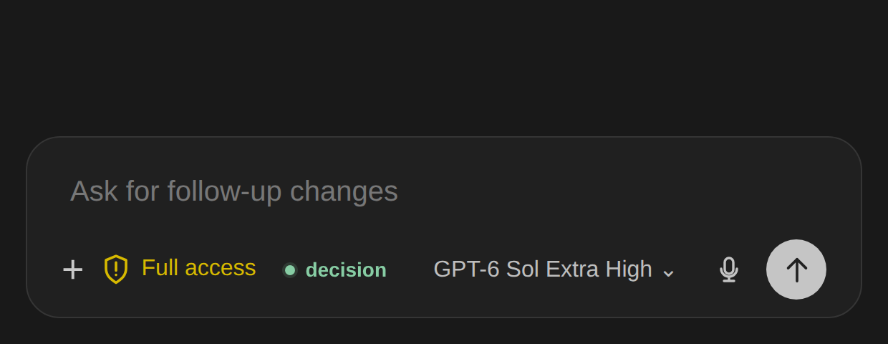
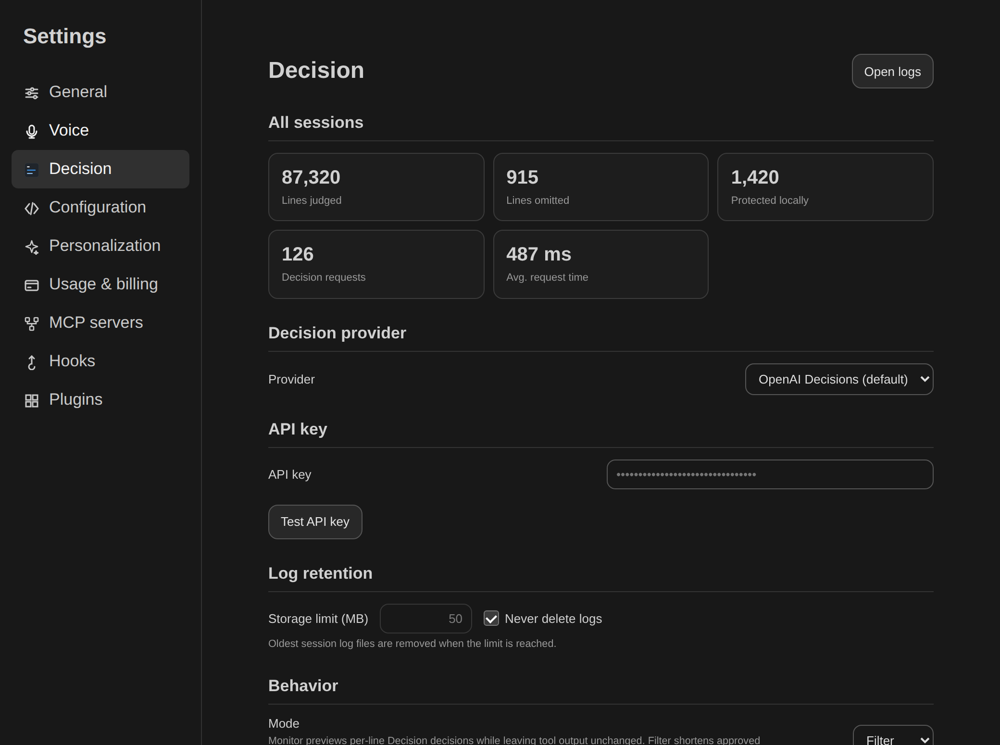
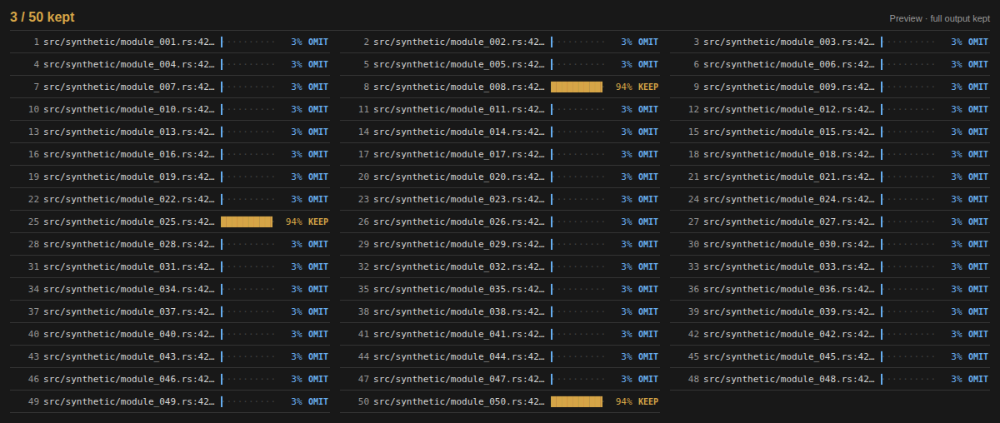

# Codex Decision


Codex Decision removes repetitive lines from local tool output before Codex reads them. Errors and useful evidence stay visible. Every shortened result links to the complete original.

**Codex Decision 0.11.0 · VS Code control 0.10.3** — [Download the latest release](https://github.com/PhilippElhaus/Codex-Decision/releases/tag/v0.11.0).

## Get started

Install the plugin on Linux x86_64:

```bash
codex plugin marketplace add https://github.com/PhilippElhaus/Codex-Decision
codex plugin add codex-decision@codex-decision
```

Trust the Decision hook in `/hooks`. For the screens below, install the optional [VS Code control and composer patch](vscode-control/README.md#install). Run **Developer: Reload Window**, then start a new local Codex thread. See [installation and upgrades](docs/setup/setup_installation.md) for details.

### 1. Connect Decision

Sign in to Codex, select **OpenAI Decisions** (default) or **TypeSafe Jev**, then enter and test that provider’s API key in **Connect Decision**. The key stays out of chat.



### 2. Turn Decision on or off

Click **decision** in the composer. Each thread remembers its choice. Eligible output is sent to the selected provider while Decision is enabled.



### 3. Adjust the details

Open **Codex settings → Decision** to choose **Monitor** (keep full output) or **Filter** (shorten approved output). Manage the relevance cutoff, API key, and log retention here. Settings apply to all sessions.



### 4. Inspect a result

Open the **Decision** panel beside **Terminal** and **Output**. Blue rows mark proposed omissions; gold rows mark kept lines. Bars show relevance. Hover for excerpts and reasons. Before the first decision, the panel shows hook activity and skip reasons.



Screenshots use synthetic data. For a missing decision or failed connection, see [troubleshooting](docs/setup/setup_installation.md).

## Documentation

[API key](docs/setup/setup_credentials.md) · [Filtering rules](docs/architecture/design_integrations.md) · [Privacy and safeguards](docs/architecture/design_data.md) · [Tests](tests/README.md) · [Usage verification](docs/development/usage_optimization_2026-10-05.md) · [Provider benchmarks](docs/development/provider_benchmarks_2026-10-07.md)
