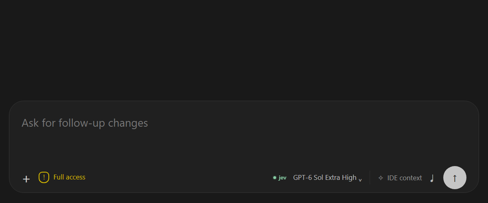

# Codex Jev


Codex Jev adds one synchronous `PostToolUse` hook to Codex. Its hook starts
unselected. Once selected, **replace** is the default mode: Jev checks large,
repetitive tool results, and approved Bash output becomes a short excerpt with
a path to the privately saved original. **Observe** mode records decisions and
keeps the full result. Text-only MCP results are evaluated but need another
opt-in to be replaced.

## Install

```bash
codex plugin marketplace add Elhaus-Labs/Codex --ref main
codex plugin add codex-jev@personal
```

Review and trust the bundled hook when prompted, then start a new Codex
thread. Upgrades from the former `codex-jev-output-pilot` ID require the
[migration steps](#upgrade-from-the-former-pilot-id) below to preserve the
selected hook, saved output, and credential setup.
Install the credential helper below before selecting the hook. CLI users can
select it by setting `enabled: true` in `PLUGIN_DATA/config.json`. The VS Code
control offers a checkbox and status indicator; see its
[setup and rollback guide](vscode-control/README.md).

## Interface preview

These screenshots use synthetic data and the real composer control script.
They contain no workspace output or credentials.




The [blue call state](docs/images/jev-pulse.png) fades in and out as shown in
the [pulse timeline](docs/images/jev-pulse-timeline.svg). The
[decision and credential flow](docs/images/jev-flow.svg) shows the data path.

## Credentials

Install the Windows request helper and protect the key with CurrentUser DPAPI.
For a portable setup, enter the key at the protected prompt:

```powershell
pwsh -File .\plugins\codex-jev\scripts\install_key_cache.ps1 -PromptForKey
```

To refresh automatically from an existing Vaultwarden helper, configure that
helper locally. It must support `materialize -CollectionName ... -Name ...
-OutputPath ...`:

```powershell
pwsh -File .\plugins\codex-jev\scripts\install_key_cache.ps1 `
  -VaultwardenHelper 'C:\path\to\vaultwarden-local.ps1' `
  -CollectionName '<collection>' -ItemName '<item>'
```

The encrypted key and request helper live under
`%LOCALAPPDATA%\Codex\codex-jev`; optional Vaultwarden source metadata
there contains no key. The WSL hook sends a bounded request to the Windows
helper over stdin. The key does not enter WSL environment variables, command
arguments, plugin data, or Jev logs. The control checks health when enabled
and every five minutes. A configured Vaultwarden source can refresh a missing
or rejected key; prompt-based setup requires another prompt if the key changes.

## Decisions and data

| Gate or outcome | Behavior |
| --- | --- |
| Hook unselected | No Jev request or log entry. |
| Fewer than 8,192 or more than 2,000,000 characters | Skip locally. |
| Secret-looking input/output, diagnostics, structured or media MCP response, or low repetition | Keep full result; no Jev request. |
| Jev unavailable, invalid scores, or uncertain decision | Keep full result. |
| Strongly repetitive Bash output in replace mode | Save exact original, then return a head/tail excerpt and its path. |
| Eligible result in observe mode | Record a candidate; Codex receives full result. |
| Eligible text-only MCP output | Observe by default; set `allow_mcp_replacement: true` in `config.json` to opt in. |

Before a Jev request, the hook filters output locally and samples at most
12,000 characters by default. Jev answers three `Noul` judgments: routine
noise, need for exact text, and one-off value. The sensitive-content filter is
conservative and cannot prove arbitrary text is safe to send to an external
API; enable the hook only where this data boundary is acceptable. The Jev
request has a three-second deadline; the hook has a five-second timeout.

The exact original is stored at
`PLUGIN_DATA/outputs/<session-hash>/<call-hash>.txt` with owner-only permissions.
The replacement excerpt names that path for recovery. `PLUGIN_DATA/events.jsonl`
stores decision metadata, scores, sizes, and elapsed time, not raw output. The
extension reads only this metadata. Do not publish the plugin data directory;
saved originals are retained until you remove them. The
[config example](config.example.json) lists all defaults: enablement, mode,
minimum and maximum size, sample size, timeout, model, and MCP opt-in. The
plugin rejects unknown or invalid config values.

## VS Code control

The companion extension in [`vscode-control/`](vscode-control/) provides a
status-bar item and a private bridge for a `jev` composer button. Clicking
either opens a one-hook selection list; clearing it disables Jev. Gray means
off, green means API/key health passed, red means health failed, and blue pulses
for about 500 ms during a Jev call or health probe. When `codexJev.mode` is
`observe`, both controls show `OBS`. The default setting is `replace`.

The composer button docks before the model selector, contracts to its dot in a
narrow panel, and hides before it could overlap the selector. Its hover panel
shows mode, call totals, average duration, characters checked, and up to three
recent outcomes across tools. Small skipped results do not erase those
outcomes. Counters and outcomes start empty when a composer view opens and
reset on a new view URL, reload, or hook deactivation. Historical entries in
the shared log are never replayed into a new view. These are **view-scoped**
totals, not persisted per-conversation analytics.

Set `codexJev.dataDirectory` to the installed absolute `PLUGIN_DATA` directory
(a `\\wsl.localhost\<distro>\...` path on Windows), or set the
`CODEX_JEV_DATA_DIRECTORY` environment variable. A personal installation can
use `~/.codex/plugins/data/codex-jev-personal` in WSL. The public
extension package has no workstation-specific default. Mode changes are made
in VS Code's **Codex Jev Control: Mode** setting. The hook checkbox changes
only enablement.

Codex offers no supported third-party composer control slot. The button uses
a **version-pinned local patch** for Codex VS Code extension `26.917.62051`.
[`patch_codex_webview.py`](vscode-control/patch_codex_webview.py) checks exact
host hashes and keeps rollback files under
`%LOCALAPPDATA%\Codex\codex-jev\rollback\26.917.62051`. A Codex
extension update may invalidate the patch; validate the new version before
reapplying. Reload each VS Code window where the button should appear. The
status bar remains available if the composer button cannot fit.

On Windows with a WSL Codex app server, the plugin detail page can fail with
`AbsolutePathBuf deserialized without a base path` if VS Code sends this
marketplace's Windows path to the WSL server. The version-pinned host bridge
maps only this repository's marketplace path to its WSL absolute path for
`plugin/read`; it leaves other requests untouched. The Jev hook itself is
independent of this page. A missing cached hook file or hook process failure
returns the original tool result without replacement.

## Upgrade from the former pilot ID

The plugin folder and installed ID are now `codex-jev`. The former ID's data
and Windows credential directory do not move automatically. From this repo,
run these once before removing the old installation:

```bash
python3 plugins/codex-jev/scripts/migrate_legacy_data.py
pwsh.exe -NoProfile -NonInteractive -File plugins/codex-jev/scripts/migrate_legacy_key.ps1
codex plugin add codex-jev@personal
```

The data migration copies `config.json`, decision metadata, and saved originals
to `~/.codex/plugins/data/codex-jev-personal`. It verifies conflicts and leaves
the former data intact. The key migration uses the former local Vaultwarden
source metadata to install a fresh protected cache under
`%LOCALAPPDATA%\Codex\codex-jev`; it does not copy the encrypted key between
Windows accounts. If the former setup used a manual prompt, rerun
`install_key_cache.ps1 -PromptForKey` instead. Set `codexJev.dataDirectory`
to the new data path, reload VS Code, and start a new Codex thread. Remove the
former plugin and companion extension after the new installation works. Keep
the former saved outputs if old threads still refer to their paths.

Hosted tools such as web search do not pass through this hook. For nested
JavaScript tool calls, Codex returns the original result to the running script.
Replacement reduces model-visible text only when the raw result would
otherwise reach the model; a script that already summarizes output gains
little or no model token savings.

## Verification and measurement

Run from the repository root:

```bash
python3 -m unittest discover -s plugins/codex-jev/tests -v
python3 plugins/codex-jev/scripts/replay.py --per-category 100
python3 plugins/codex-jev/scripts/benchmark_context.py
npm --prefix plugins/codex-jev/vscode-control test
python3 -m unittest discover -s plugins/codex-jev/vscode-control/tests -p 'test_*.py' -v
python3 plugins/codex-jev/vscode-control/scripts/browser_smoke.py
pwsh -File plugins/codex-jev/scripts/test_key_cache.ps1
python3 plugins/codex-jev/scripts/live_bridge_smoke.py
python3 plugins/codex-jev/scripts/measure_live.py --repetitions 5
python3 plugins/codex-jev/scripts/replay.py --live --bridge --per-category 3 --live-max-calls 30
```

The first seven commands are offline. The replay covers 1,000 deterministic
cases. Python tests cover policy gates, exact output recovery, failure paths,
and config; Node tests cover log offsets, new-view resets, selection, health,
and statistics. The Edge browser harness exercises layout, tooltip, colors,
pulse, and navigation at two widths. Patch tests exercise apply/update/restore
and tamper rejection. The last three Python commands require a working Jev key
and issue real requests. `measure_live.py` uses synthetic logs and disposable
plugin data; it measures hook latency and model-visible output size. Both
benchmark scripts use exact `o200k_base` counts when `tiktoken` is installed,
otherwise they label their four-characters-per-token proxy. That encoding is
a context-size comparison, not verified Codex model billing. Neither script
measures a complete Codex task or model inference time.

A prior 90-case live Jev replay made 30 calls and selected 10 repetitive Bash
outputs with no false or missed replacements against synthetic labels. Those
labels do not establish accuracy on real tasks.

On 2026-09-26, three live Jev calls per active mode against synthetic
11.5k-character Bash logs gave these hook-level results through the actual
Windows credential bridge:

| Mode | Median hook wall time | Model-visible tool text across three runs |
| --- | ---: | ---: |
| Off | 445 ms | 34,656 characters |
| Observe | 1,562 ms | 34,656 characters |
| Replace | 1,614 ms | 2,697 characters |

All three replace calls selected replacement, a 92.2% character reduction.
The wall times include Python process startup and bridge work, and varied from
run to run.

A second 2026-09-26 run used five live Jev calls per active mode and exact
`o200k_base` counts for the same synthetic build logs:

| Mode | Median hook wall time | Model-visible tokens across five runs |
| --- | ---: | ---: |
| Off | 213 ms | 16,290 |
| Observe | 1,381 ms | 16,290 |
| Replace | 1,385 ms | 1,316 |

All five eligible replace calls succeeded. The **91.9% token reduction** on
those outputs saved 14,974 tokenizer units while adding a median 1.17 seconds
of hook latency per call against off. A rough break-even would require the
downstream model to process at least 2,555 input tokens per second if no other
latency changed; that rate has not been measured here. Context relief can
still matter when time savings are zero. A separate live 27-case replay made
Jev calls only for eligible text; it selected all three repetitive Bash cases,
observed three text MCP cases, and kept 21 other results, with zero mismatches
against synthetic labels.

The 200-case mocked policy/context benchmark selected 20 repetitive outputs,
left 180 unchanged, and removed 61,990 of 545,170 `o200k_base` tokens (11.4%
across this deliberately mixed corpus). The selected outputs alone shrank
93.2%, saving a median 3,100 tokens per selected output, about 2.4% of a 128k
context window. These figures are context-size estimates, not measured Codex billing or
full-task savings. They apply only if raw tool text reaches the model; a nested
tool script that already summarizes the text gets little or no benefit.
