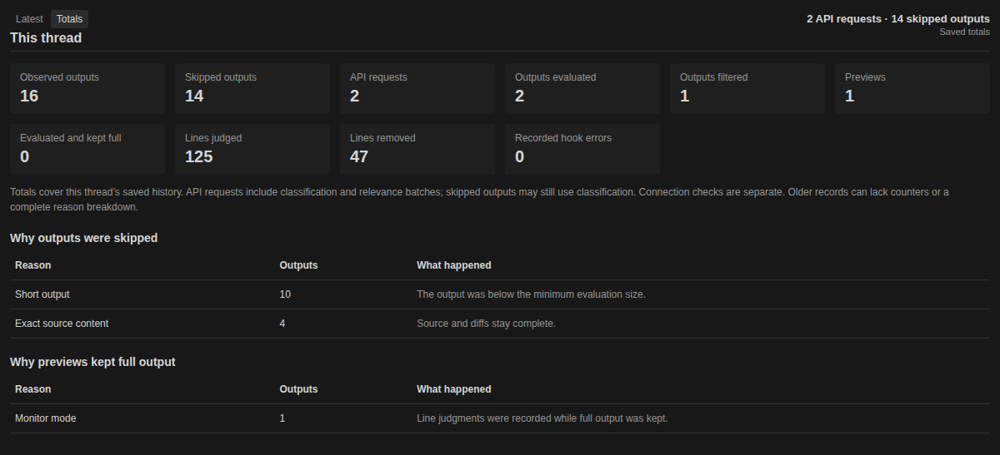

# Codex Decision


Codex Decision selects repetitive lines for removal from supported local tool output. Errors and useful evidence stay visible. Every shortened result links to the complete original.

**Codex Decision 0.11.7** — [Download the integrated VSIX](https://github.com/PhilippElhaus/Codex-Decision/releases/latest).

## Get started

Install the single VSIX in Windows VS Code with a Linux x86_64 WSL environment:

```bash
code --install-extension codex-decision-0.11.7.vsix --force
```

The package contains the hook, skill, session controls, settings, and verified Codex UI patch. On activation it installs or updates the local plugin and repairs supported Codex builds. Existing plugin data and thread choices remain in place. Run **Developer: Reload Window** after the integration repair, then open your Codex thread. Review the hook in `/hooks` if Codex requests trust. No second package or manual composer patch is needed.

Use **Decision: Check Integration** for status and **Decision: Repair Integration** to restore the controls and reopen a hidden Decision panel. Unsupported Codex builds produce a visible diagnostic. See [installation and upgrades](docs/setup/setup_installation.md) for details and standalone CLI setup.

### 1. Connect Decision

Sign in to Codex, select **OpenAI Decisions** or **TypeSafe Jev**, then enter and test that provider’s API key in **Connect Decision**. The key stays out of chat.


### 2. Turn Decision on or off

Click **decision** in the composer. Each thread remembers its choice. Eligible output is sent to the selected provider while Decision is enabled.


### 3. Adjust the details

Open **Codex settings → Decision** to choose **Monitor** (keep full output) or **Filter** (shorten approved output). Manage the relevance cutoff, API key, and log retention here. Settings apply to all sessions.


### 4. Inspect a result

Open the **Decision** panel beside **Terminal** and **Output**. Blue rows mark proposed omissions; gold rows mark kept lines. Bars show relevance. Hover for excerpts and reasons. Before the first decision, the panel shows hook activity and skip reasons.


Select **Latest** for the current result or **Totals** for the selected thread’s saved request attempts, validated responses, evaluations, removals, and skip reasons. Switching threads restores their own counters. Incomplete older history shows a lower bound (`≥`) or an unknown count (`—`).



Screenshots use synthetic data. Code-mode scripts can still serialize the original tool result after a hook records a replacement, so the panel’s removal counts do not establish downstream token savings. See the [processing investigation](docs/development/processing_recovery_2026-10-08.md) and [troubleshooting](docs/setup/setup_installation.md).

## Documentation

[API key](docs/setup/setup_credentials.md) · [Filtering rules](docs/architecture/design_integrations.md) · [Privacy and safeguards](docs/architecture/design_data.md) · [Tests](tests/README.md) · [Request reliability audit](docs/development/reliability_audit_2026-10-08.md) · [Panel and skip investigation](docs/development/panel_activity_2026-10-08.md) · [Usage verification](docs/development/usage_optimization_2026-10-05.md) · [Provider benchmarks](docs/development/provider_benchmarks_2026-10-07.md)
