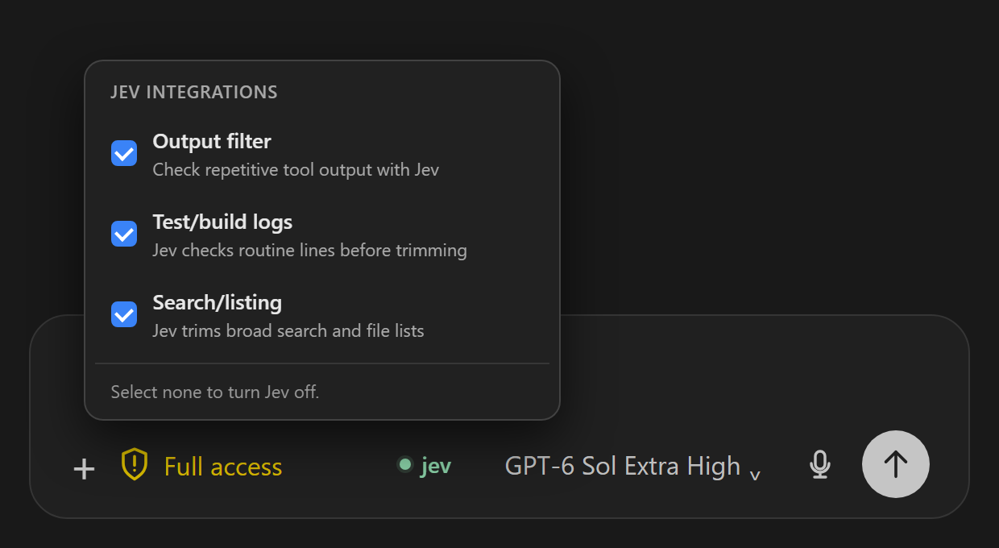
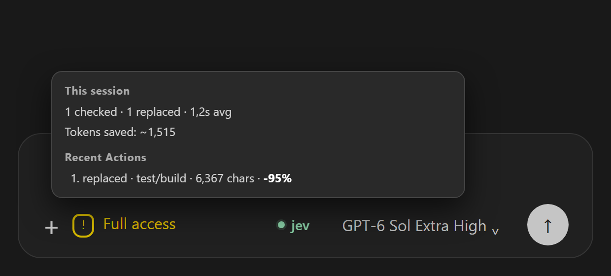

# Codex Jev


Codex Jev trims large tool results before Codex reads them. It uses Jev to decide which repetitive lines can be omitted, keeps the exact original for recovery, and leaves uncertain results intact.

## Integrations

| Selectable integration | What Codex gets |
| --- | --- |
| Output filter | A shorter excerpt of repetitive tool output. |
| Test/build logs | Failures and completion summaries without routine pass and progress lines. |
| Search/listing | Relevant matches and representative file paths from broad results. |

All integrations start off. The button in the Codex composer selects them and shows Jev health and recent outcomes. The images show synthetic activity.



## Measured results

A [live hook benchmark](docs/benchmarks/benchmark_live_2026-09-26.md) ran the three integrations over real command output with 30 Jev calls. Token counts use `o200k_base`.

| Integration | Replaced results | Model-visible tokens saved | Reduction on replaced results |
| --- | ---: | ---: | ---: |
| Output filter | 9 | 48,886 | 95.3% |
| Test/build logs | 12 | 13,475 | **90.0%** |
| Search/listing | 3 | 8,346 | 71.3% |

Across all 36 results, including oversized inputs that the hook deliberately skipped, the integrations saved **70,707 model-visible tokens**. These are tool-output measurements, not billed-token or full-task savings. Jev kept all six search-hit outputs when it was uncertain.



## Quick install

```bash
codex plugin marketplace add https://github.com/PhilippElhaus/Codex-Jev
codex plugin add codex-jev@codex-jev
```

Download the [VS Code control VSIX](https://github.com/PhilippElhaus/Codex-Jev/releases/latest). From its download directory, run `code --install-extension codex-jev-control-0.2.6.vsix --force`. [Add the Jev API key](docs/setup/setup_credentials.md), set `codexJev.dataDirectory` to the plugin data directory, and apply the [version-pinned composer patch](vscode-control/README.md). Start a new Codex thread.

## Documentation

- [Installation](docs/setup/setup_installation.md), [credentials](docs/setup/setup_credentials.md), and [migration](docs/setup/setup_migration.md)
- [Integration design](docs/architecture/design_integrations.md) and [data handling](docs/architecture/design_data.md)
- [VS Code control](docs/architecture/design_vscode.md)
- [Benchmarks](docs/benchmarks/benchmark_live_2026-09-26.md) and [verification](docs/development/development_verification.md)
