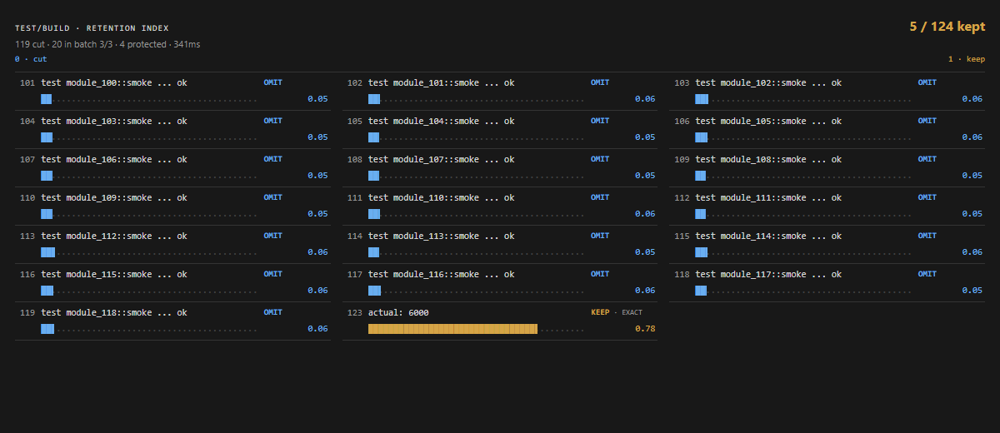
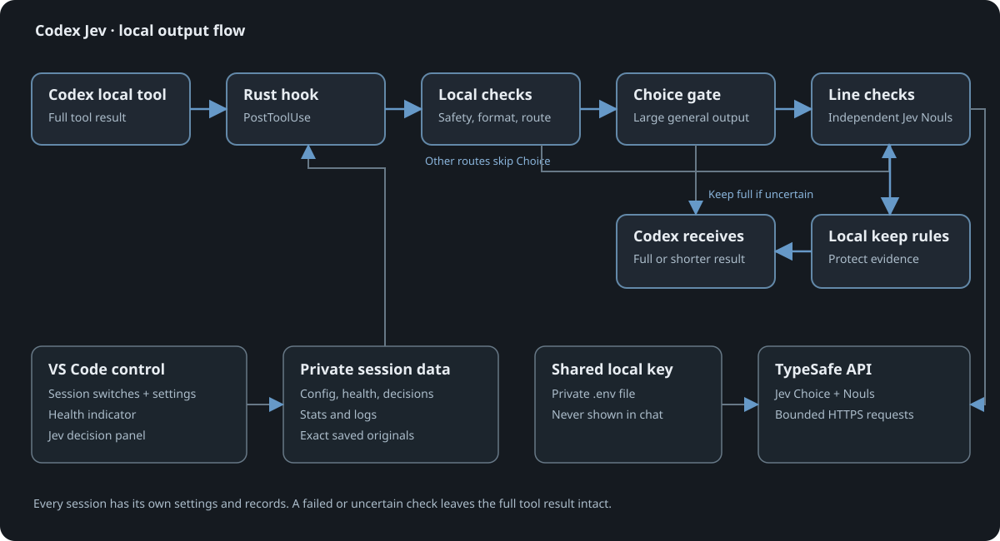

# Codex Jev


Codex Jev cuts repetitive lines from local tool output before Codex reads them. It keeps errors and useful details, and every shortened result points to a private copy of the complete original.

**What you gain:** less log noise in the conversation, a way to inspect what was kept, and clear status when the filter has not run or has failed. Savings depend on the output, the configured cutoffs, and Jev's judgments.

## Version 0.8.3

[Build the Linux x86_64 plugin and VS Code control 0.7.8](docs/setup/setup_installation.md), or download the [previous packaged release 0.8.1](https://github.com/PhilippElhaus/Codex-Jev/releases/tag/v0.8.1).

- **More supported output:** simple batches with compatible routes and whole-line log viewers reach Jev. Local tool text arrays can receive preview judgments.
- **Visible skips:** the activity tooltip explains why the latest result was skipped, even when no decision exists.
- **Current Codex support:** the composer patch supports builds `26.928.31416` and `26.930.21537`. Each build uses checked source hashes and its own rollback directory.

The default line cutoffs remain 95% minimum confidence to omit and 5% maximum need for exact text. Existing secret checks and log retention settings remain unchanged.

## Get started

On Linux x86_64, install the plugin:

```bash
codex plugin marketplace add https://github.com/PhilippElhaus/Codex-Jev
codex plugin add codex-jev@codex-jev
```

Open `/hooks` in Codex and trust the Jev hook. Do this again when an update changes the hook definition. Start a new Codex thread after installation or upgrade. The optional [VS Code control](vscode-control/README.md) adds the screens below; its composer control needs the documented patch for the supported Codex extension version.

### 1. Connect Jev

Sign in to Codex, open a thread, then enter and test your typesafe.ai API key in **Connect Jev**. The key is shared by this local installation and stays out of chat.


### 2. Choose a filter for this session

The VS Code control selects all three filters for a new local thread. In the **jev** menu, you can turn off regular output, test and build logs, or search results and listings separately. Existing thread choices stay as you left them. Eligible text is sent to TypeSafe when a filter and API key are active.


### 3. Adjust the details

Open **Codex settings → Jev** at any time to choose **Monitor** (show decisions, keep full output) or **Filter** (shorten approved output). The mode, cutoffs, log retention, and API key apply to all sessions. The page shows installation totals. For long general output, a Jev choice check can decide whether line filtering is useful; uncertain output stays complete. You can turn this check off in settings.


### 4. Inspect a result

The **Jev** panel shows the latest decision from this session. Blue lines were cut; gold lines were kept. This synthetic example keeps 3 of 50 lines. A shortened result also gives Codex the path to its complete original.


The composer indicator is **green** when a small Jev API check succeeds and **red** when the key or API check fails. It stays amber while the check is pending. A hook error appears in the activity tooltip during a thread. On the home screen, the tooltip stays hidden and the indicator still shows API health.

## Jev in action

The [live demo](docs/development/quality_demo.md) sent eight synthetic fixtures to Jev 1.13.0 with a reviewed **70% omission / 25% exact-text** trial. It kept all 224 required lines, including all 214 holdout lines. Saved originals matched the source byte for byte.

| Example | Lines omitted / seen | Evidence kept |
| --- | ---: | --- |
| Build failure | 116 / 125 | Version and diagnostics |
| Failing tests | 119 / 124 | Expected/actual values and failure total |
| Current timeout search | 44 / 47 | Current paths and values |
| Every configuration constant | 0 / 90 | Every value |
| Every latency measurement | 0 / 60 | Every measurement |

The image below replays the final batch from the failing-test demo in the real panel. Four diagnostic lines are protected outside this batch; Jev also keeps `actual: 6000`.



These results measure evidence retention on this corpus. The unchanged 95/5 defaults omitted no lines when the same judgments were replayed. Review your workload before changing cutoffs.



## More detail

[Install and verify](docs/setup/setup_installation.md) · [API key](docs/setup/setup_credentials.md) · [What gets filtered](docs/architecture/design_integrations.md) · [Privacy and safeguards](docs/architecture/design_data.md) · [Tests](docs/development/development_verification.md) · [Live demo results](docs/development/quality_demo.md) · [45-second Jev explainer by Matija Sosić](https://x.com/MatijaSosic/status/2100190746389135772)
