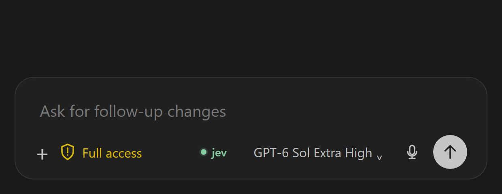
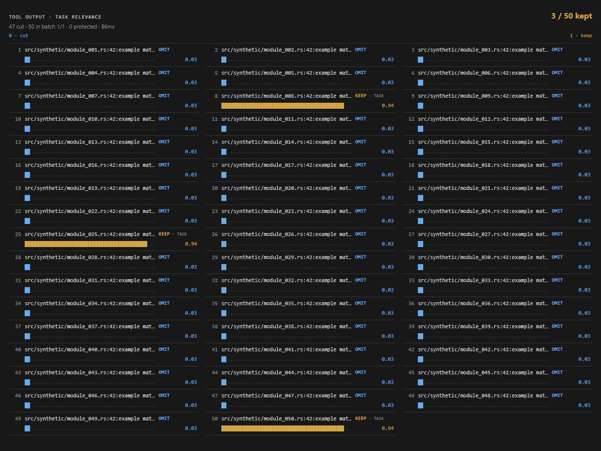

# Codex Jev


Codex Jev cuts repetitive lines from local tool output before Codex reads them. It keeps errors and useful details, and every shortened result points to a private copy of the complete original.

**What you gain:** less log noise in the conversation, a way to inspect what was kept, and clear status when the filter has not run or has failed. Savings depend on the output, the configured cutoffs, and Jev's judgments.

## Version 0.10.1

[Download release 0.10.1 with VS Code control 0.9.2](https://github.com/PhilippElhaus/Codex-Jev/releases/tag/v0.10.1), or [build both packages](docs/setup/setup_installation.md).

- **One switch:** click **jev** to turn filtering on or off for the current thread. The integration popup is removed.
- **One policy:** supported tool output uses the same relevance cutoff. Settings no longer contain separate filter categories or a search-only relevance guard.
- **Existing settings:** old switches migrate to on when any was on. Legacy settings migrate to a relevance cutoff no higher than 5%.

Jev first classifies a sampled excerpt. When the combined probability of an excerptable class is at least 95%, the second stage judges every candidate line for task relevance in API-bounded batches. It has no 250-line cap. The default maximum relevance for omission is 5%. Uncertain, unsupported, oversized, or failed results stay complete. See the [two-stage design](docs/architecture/design_integrations.md) and [batching verification](docs/development/batching_verification.md).

## Get started

On Linux x86_64, install the plugin:

```bash
codex plugin marketplace add https://github.com/PhilippElhaus/Codex-Jev
codex plugin add codex-jev@codex-jev
```

Open `/hooks` in Codex and trust the Jev hook. Do this again when an update changes the hook definition. Start a new Codex thread after installation or upgrade. The optional [VS Code control](vscode-control/README.md) adds the screens below; its composer control needs the documented patch for the supported Codex extension version.

### 1. Connect Jev

Sign in to Codex, open a thread, then enter and test your typesafe.ai API key in **Connect Jev**. The key is shared by this local installation and stays out of chat.


### 2. Turn Jev on or off

The VS Code control enables Jev for a new local thread. Click **jev** to turn it off or on. The button is gray when off; its on/off state is also available to assistive technology. Each thread keeps its own choice. Eligible text is sent to TypeSafe when Jev and the API key are active.



### 3. Adjust the details

Open **Codex settings → Jev** at any time to choose **Monitor** (show decisions, keep full output) or **Filter** (shorten approved output). The mode, cutoffs, log retention, and API key apply to all sessions. The page shows installation totals. Classification always runs before eligible line filtering; it has no separate switch. Uncertain output stays complete. The shared relevance slider controls line omission.


### 4. Inspect a result

The **Jev** panel shows task relevance for each judged line in the latest decision from this session. Blue lines were cut; gold lines were kept. This synthetic example keeps 3 of 50 lines. A shortened result also gives Codex the path to its complete original.



The composer indicator is **green** when a small Jev API check succeeds and **red** when the key or API check fails. It stays amber while the check is pending. A hook error appears in the activity tooltip during a thread. On the home screen, the tooltip stays hidden and the indicator still shows API health.

## Jev in action

The [initial two-stage evaluation](docs/development/two_stage_evaluation.md) uses 35 base cases and 19 holdout cases with reviewed evidence labels. It includes logs, progress, search hits, file lists, source, diffs, structured data, exact values, injection text, Unicode, line endings, and budget limits. Offline faults test failed requests and invalid responses. That report records the single-request baseline. The [batching verification](docs/development/batching_verification.md) covers current API limits and complete multi-batch coverage. The report distinguishes model quality from application correctness and records actual usage and latency.

The [historical eight-case demo](docs/development/quality_demo.md) measures the retired omission/exact-text questions. Its 70/25 and 95/5 results do not calibrate current task relevance.

## More detail

[Install and verify](docs/setup/setup_installation.md) · [API key](docs/setup/setup_credentials.md) · [What gets filtered](docs/architecture/design_integrations.md) · [Privacy and safeguards](docs/architecture/design_data.md) · [Tests](docs/development/development_verification.md) · [Live demo results](docs/development/quality_demo.md) · [45-second Jev explainer by Matija Sosić](https://x.com/MatijaSosic/status/2100190746389135772)
