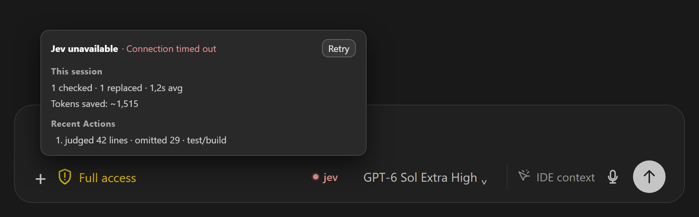

# VS Code control

The companion extension connects the Jev button in the Codex composer to the installed plugin. The button opens three checkboxes. The menu stays open while selections change; click outside or press Escape to close it. Clear all checkboxes to turn Jev off. The extension checks Jev health and reads recent decision metadata.

The first selected integration opens a full overlay inside the Codex side window when the configured plugin data directory has no readable API key. A solid backdrop hides the chat list. The overlay uses a subdued, animated ASCII field inspired by the installed Codex sign-in screen, with a static fallback for reduced motion. The link below Save and Skip sends a fixed `openTypeSafe` action through the local bridge. The extension opens `https://typesafe.ai/` in the system browser and returns success or failure to the overlay. Skip dismisses the overlay for that window; the Jev menu and compact missing-key tooltip reopen it. The card stacks its actions in narrow panels and puts Skip at the right in wide panels. The entered key passes through the local Codex webview bridge to the extension for testing or storage. Codex settings shows a **Jev** tab below **Voice**. The extension sends only the saved key length to render its password mask. An empty key field there tests or keeps the saved key. Test results appear beside the button. The top of the page shows cumulative lifetime totals and opens the session logs in the system file manager. Log retention accepts 1–9999 MB and starts at 50 MB; the VS Code style Never delete logs checkbox saves immediately and disables the limit field. Each filter heading has a short description and checkboxes for its implemented Jev methods. Output and test/build support Noul and Choice; search/listing supports Choice. Score is not used. Disabled methods do not send questions to Jev, and a filter with no enabled methods leaves output unchanged. Each percentage cutoff has a visible slider track and a synchronized text field that shows `%` when it loses focus. Invalid percentages restore the last valid slider value on blur and fail save validation. The controls wrap below the label in narrow panels. Reset defaults sits on the right of the action row and stages the default mode, cutoffs, methods, and log retention until Save settings applies them.

The button stays on the toolbar row and beside the model control when Codex shows icon-only controls or the gap closes. Once it becomes a dot, it stays a dot as the pane gets narrower. Gray means off, green means connected, red means unavailable, and blue means a request is in progress. `MON` marks Monitor mode when the full label fits. The tooltip shows activity for the current composer view, with a new view starting at zero. Recent actions show bold negative percentages for reductions. The token total estimates model-visible text saved from the removed character count using [OpenAI's rough four-characters-per-token rule](https://developers.openai.com/api/docs/concepts#tokens); it is not a billed-token count. A failed health check shows a short reason and Retry button, and the extension rechecks failed connections every 30 seconds.

Set `codexJev.dataDirectory` to the installed `PLUGIN_DATA` directory. The extension has no machine-specific default. See [installation](../setup/setup_installation.md).

Codex has no supported third-party composer slot. The button needs the [version-pinned local patch](../../vscode-control/README.md) for Codex extension `26.917.62051`. The patch checks host hashes and keeps rollback files outside this repository. A Codex update can require a new patch. The Jev hook keeps the full result if its process fails.
