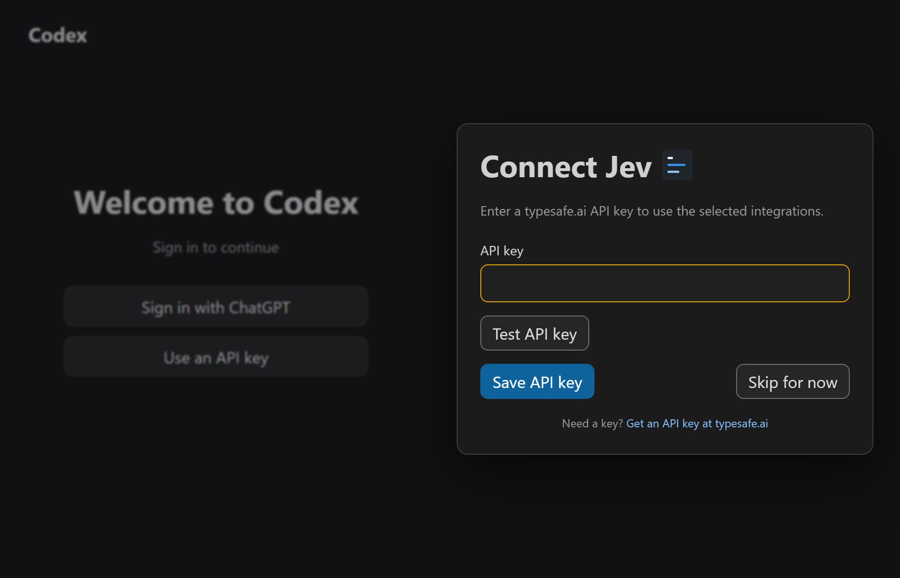
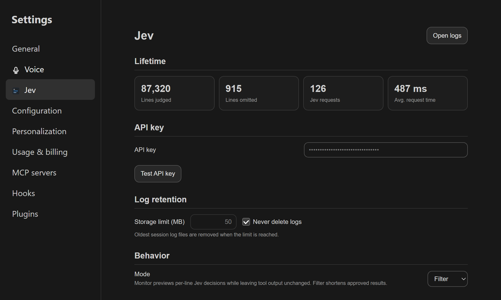
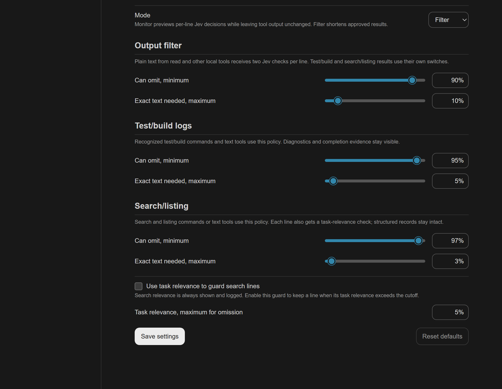

# Codex Jev control for VS Code

The companion extension connects the `jev` button in the Codex composer to the installed plugin. It selects three independent integrations: output filter, test/build logs, and search/listing. See [UI behavior](../docs/architecture/design_vscode.md).

## Install the companion extension

From WSL, build the VSIX in the repository's submission directory and install it in Windows VS Code:

```bash
mkdir -p ../.local/submission
npx @vscode/vsce package --no-dependencies --out ../.local/submission/codex-jev-control-0.2.31.vsix
code --install-extension "$(wslpath -w ../.local/submission/codex-jev-control-0.2.31.vsix)" --force
```

Set `codexJev.dataDirectory` to the installed plugin's absolute `PLUGIN_DATA` path (on Windows, a `\\wsl.localhost\<distro>\...` path for a WSL installation). `CODEX_JEV_DATA_DIRECTORY` is an alternative. The extension has no machine-specific default. It reads `PLUGIN_DATA/.env` to probe API health. During first setup, the entered key travels through the local Codex webview bridge to the extension; it is not sent as chat text. See [key setup](../docs/setup/setup_credentials.md).

The VSIX includes `patch_codex_webview.py`, `webview/jev-control.js`, and `webview/jev-settings.js`. Run the patch from this checkout or the installed VSIX directory. It supports Codex extension `26.917.62051` and checks exact host hashes. The patch also maps WSL plugin image paths so Windows VS Code can show the Codex Jev and Codex Chime icons. Keep rollback files outside this repository:

```bash
python3 patch_codex_webview.py apply \
  --extension '/mnt/c/Users/<user>/.vscode/extensions/openai.chatgpt-26.917.62051-win32-x64' \
  --backup '/mnt/c/Users/<user>/AppData/Local/Codex/codex-jev/rollback/26.917.62051'
```

Use `update` to refresh an already patched installation, or `restore` with the same paths to roll back. Validate the patch again after a Codex update. Reload each VS Code window after applying or restoring. The bridge can also translate the marketplace path for `plugin/read` when Codex runs in WSL.

## Use it

Select integrations in the composer menu. An empty selection turns Jev off. When an integration is enabled without a key, **Connect Jev** covers the Codex side window with a solid backdrop and asks for a typesafe.ai API key. A link below Save and Skip opens the typesafe.ai homepage in the system browser. If the browser cannot open, the overlay shows an error. Test and save the key in Connect Jev, or choose **Skip for now** to return to Codex; **Connect Jev…** in the Jev menu or **Connect** in the compact missing-key tooltip reopens it. The setup card stacks its buttons when the side window is narrow.

The **Jev** tab appears in the bottom Panel beside Output and Terminal after installing the extension. Use the panel tab's context menu to hide it; choose **View → Open View… → Jev: Latest decision** to restore it. **Jev: Show Latest Decision** is also available in the Command Palette. VS Code does not offer extensions a contribution point for adding a direct entry to its top-level View menu. The panel updates while visible. Its fixed five-row history shows one capitalized thematic summary and measured Jev processing time per request; new rows enter at the bottom, older rows move up, and the oldest disappears after five. Times use whole milliseconds below one second (`4ms`) and two decimal places in seconds (`2.55s`), without brackets; a separate theme-aware gray keeps them legible in dark and light modes. The Choice and Noul cards keep fixed positions and show only the newest request, dimming when a result is unavailable. Active full-block (`█`) bars grow together over 800 ms, then the percentages fade in over 170 ms. The Jev panel runs this animation even when a global reduced-motion preference is set. The Choice heading identifies output, test/build, or the first search result group. The private snapshot stores fixed decision labels, probabilities, and at most five summary codes and durations. It does not store the command, API key, raw tool text, or full receipt. The panel starts showing history after the updated plugin hook writes a new request; start a new Codex thread after updating the plugin.

To preview every supported panel state without calling Jev, run `python3 scripts/demo_panel.py --data-dir <installed-PLUGIN_DATA>` from the repository root while the Jev tab is visible. The demo cycles output and test/build results with Choice and Noul together or separately, then search/listing results with retain, summarize, and drop probabilities. It shows each of nine synthetic scenes for six seconds and repeats the set three times. It restores the previous snapshot on completion or interruption and stops if a real Jev decision arrives. Synthetic history rows are marked `[DEMO]`.

Open **Codex settings → Jev**, below **Voice**, to test or replace the key, see lifetime usage, open the session logs in Explorer, change the mode, and adjust each hook's Jev cutoffs with sliders or percentage fields. A short line under each filter heading explains what it shortens. Enter a whole number with or without `%`; the field shows `%` after it loses focus. Values outside 0–100 restore the last valid slider value and cannot be saved. The **Log retention** field accepts 1–9999 MB and defaults to 50 MB. The VS Code style **Never delete logs** checkbox saves immediately and disables that limit. **Reset defaults**, on the right of the action row, loads the default mode, cutoffs, decision methods, and log retention into the form. Select **Save settings** to apply them. Reset does not change the API key or integration selections. Output and test/build use Noul and Choice by default; their method checkboxes can disable either one. Search/listing uses Choice. Score is not used by these filters. If all methods for a filter are off, it leaves that output unchanged. The saved key is never sent back to the webview; only its length is sent to draw the mask. **Filter** shortens approved results; **Monitor** previews decisions in the logs while leaving tool output unchanged. The stored mode values remain `replace` and `observe` for compatibility. A selection or cutoff change applies when the next tool result completes. A new plugin installation or hook-code change requires a new Codex thread.

**Open logs** opens `PLUGIN_DATA/logs/` in the system file manager after the first session log exists. Before that, it opens `PLUGIN_DATA/`. Each dated session folder contains one JSON receipt for each Jev request, including each chunk request. The receipt contains exact original and visible output and the request, answer, mode, cutoffs, and decision. Its filename uses UTC `HH-MM-SS-NNN-<filter>.json`; `NNN` distinguishes receipts created in the same second. Logs and receipts are private because they can contain tool output. The oldest managed log files are deleted when the saved limit is exceeded, beginning with the next Jev event. The aggregate activity index is bounded to 1 MiB while retention is enabled. Lifetime counters live in `PLUGIN_DATA/stats.json` and survive log cleanup. Exact originals referenced in shortened results live separately under `PLUGIN_DATA/outputs/` and are outside the log limit. Existing root `events.jsonl` files remain as legacy data; the first new event imports their counters.







The [full settings capture](../docs/images/jev-settings.png) also shows search/listing cutoffs and Save settings.

## Verify

Run these commands from the repository root:

```bash
npm --prefix vscode-control test
python3 -m unittest discover -s tests/integration -p 'test_*.py' -v
python3 vscode-control/scripts/browser_smoke.py
```

The Node suite also covers settings and log edge cases and a large decision log. The browser smoke test runs the real composer control, key overlay, and settings form against a synthetic VS Code bridge. [Visual harness](../tests/browser/visual_harness.html) is the source for the illustrative composer screenshots, and the [panel harness](../tests/browser/jev_panel_harness.html) renders the real decision panel with synthetic probabilities. `vscode-control/scripts/capture_docs.py` uses Edge and Pillow to capture example state without a key. See the [full test map](../tests/README.md).
